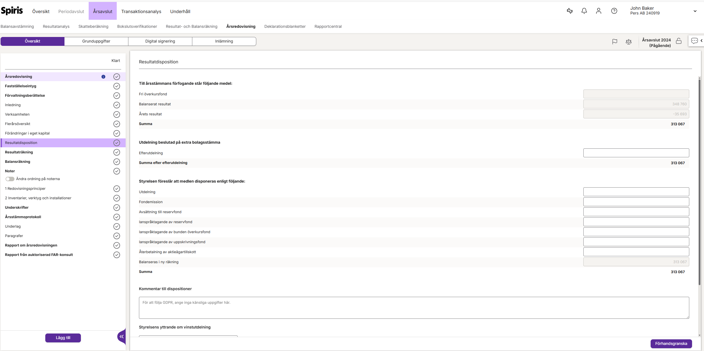

# Managing the Disposition of Earnings in Year-End Closing

## Overview
We have now made it even easier for you to manage the company's profit/loss in the reconciliation job. In the new view for appropriation of profit/loss, you get a clear overview and can easily decide how a profit or loss should be allocated. This gives you full control and makes an important part of the year-end closing both faster and more secure.

## How the Disposition of Earnings View Works
The view is divided into three parts that clearly show what funds are available, how you propose they should be allocated, and what the final result will be.

### 1. Available Funds
Here you see a summary of the capital available for allocation at the end of the year. It usually consists of:
*   **Profit or loss carried forward from the previous year:** Profit or loss transferred from previous years.
*   **Profit/loss for the year:** The company's profit or loss for the current financial year.

The sum of these constitutes the total funds that the Annual General Meeting can decide on.

### 2. Proposed Disposition
This is where you decide what will happen to the available funds. You have several options for allocating the earnings:
*   **Enter dividend to shareholders:** In the dividend field, you enter the amount you propose to be distributed.
*   **Transfer to fund for development expenditure:** If the company has capitalized development expenditure, you can allocate a corresponding amount from unrestricted equity here.
*   **Manage tax allocation reserves:** You can make appropriations to a tax allocation reserve to defer taxation, or reverse funds from an existing reserve.
*   **Carry forward in new account:** The funds remaining after your choices are automatically transferred to the next year's equity. The amount is calculated instantly as you fill in the other fields, so you can always see what the allocation looks like.

### 3. After Disposition
This section summarizes the result of your proposal. It shows the new profit or loss carried forward—that is, the equity the company brings into the next financial year. Everything is updated in real-time based on the choices you make.

**Example:**
The company has a profit of 100,000 kr and 50,000 kr in profit carried forward from previous years. In total, there are 150,000 kr available for disposition. You propose a dividend of 75,000 kr and simultaneously make an appropriation to a tax allocation reserve of 25,000 kr. You will then immediately see in the view that the remaining 50,000 kr is transferred as the new profit carried forward to the next year.

## Related Articles
*   Create Annual Report
*   Year-End Closing Checklist
*   Managing Shareholder Dividends
